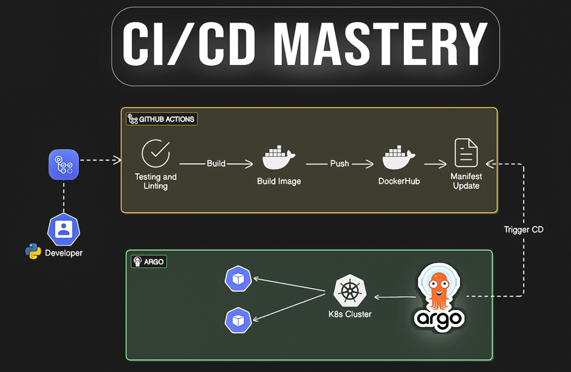
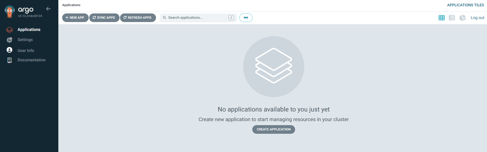
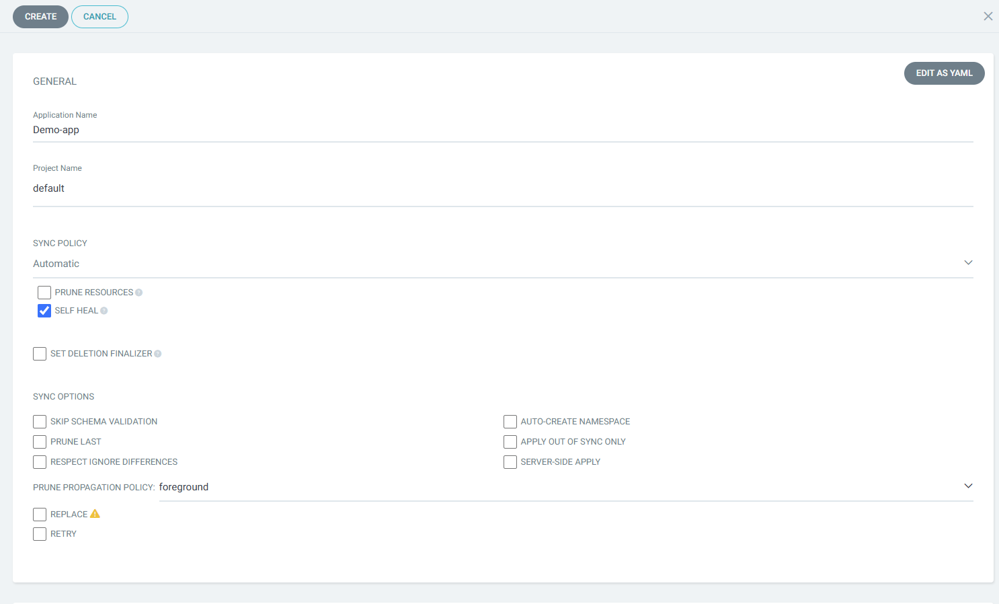
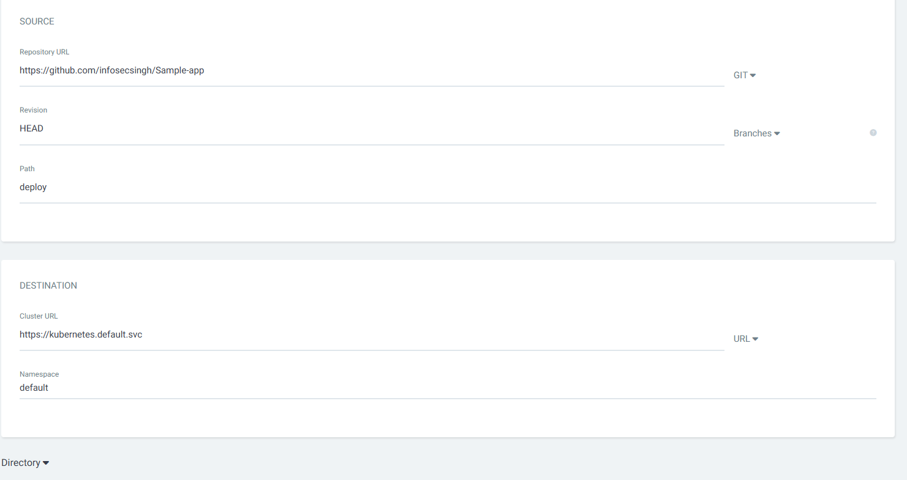
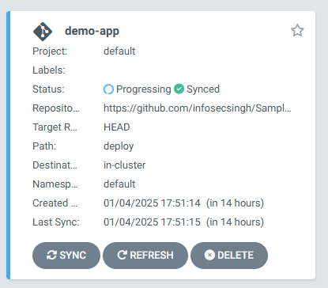
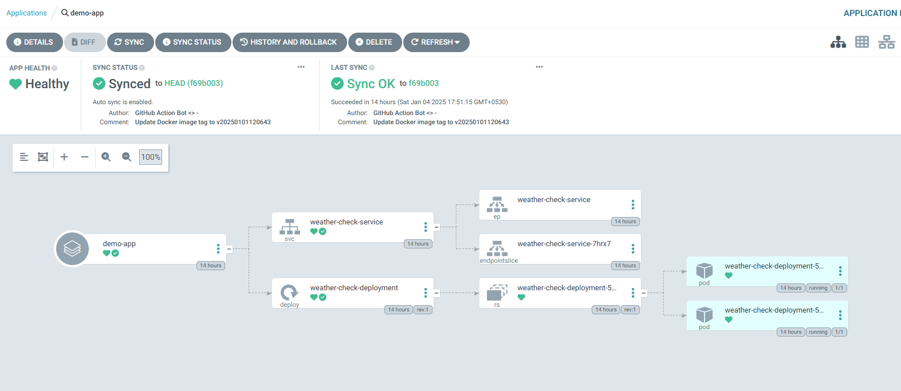
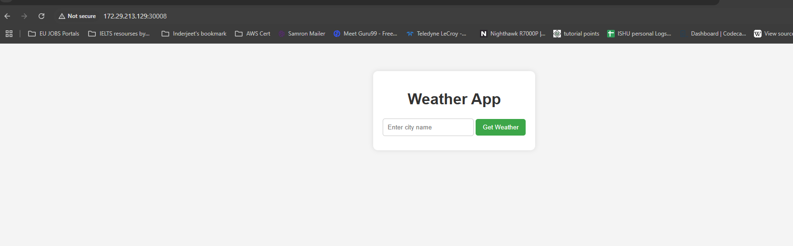

# Complete CI/CD DevOps Project 🚀
### Deploy Python Flask App on Kubernetes cluster with GitOps Approach. 



---
### Workflow:
Whenever Developer writing/changes a code and push into master/main branch, GitHub Pipeline will triggered and it will test the code with Flake8 and containerized the application with new tag and push into artifacts(dockerhub) and also GitHub Actions pipeline will update Kubernetes Manifests file with new image tag then ArgoCD will look for new changes in Manifests file and will rollout new application in kubernetes. 
```
│   app.py
│   LICENSE
│   README.md
│   requirements.txt
│
├───deploy
│       deploy.yaml
│       svc.yaml
│
├───static
│       style.css
│
└───templates
        index.html
```
---
#### What you will learn:
- Git for version control
- VS Code Editor
- Docker for testing locally
- Minikube for Kubernetes 1 Node Arch. 
- GitHub for storing code
- GitHub Actions for Continous Integrity Pipeline 
- ArgoCD for Continous Deployment Pipeline
- Python Application
    - Flask Framework
    - Flake8 Module for Linting testing  
---
## Test Application Locally. 
Whenever we are creating pipeline, it is best practice to test application locally.
- Application prequisities. 
  - Python 3.9 
  - pip installed

- Clone/Fork the Repo. 
    ```
    git clone https://github.com/infosecsingh/Flask-App-GitHub-Actions-ArgoCD.git
    cd Flask-App-GitHub-Actions-ArgoCD
    ```
- Install Dependence
    ```
    pip install -r requirements.txt
    ```
- Run locally. 
    ```
    python app.py
    ```
- Access the application.
    ```
    http://localhost:5000
    ```

Note: This application is running on 5000 port, but if you want to change, you can change the port in app.py script.

---
## Containerized Application.
Before creating pipeline, test locally if your dockerfile is accurate by running container. 
We will create Dockerfile. If you don't know what is docker, please read some basic understanding about docker: https://github.com/infosecsingh/Learn-Docker

Write Dockerfile
```
# Step 1: Base image
FROM python:3.9-slim

# Step 2: Set working directory
WORKDIR /app

# Step 3: Copy application code to the container
COPY . .

# Step 4: Install dependencies
RUN pip install -r requirements.txt

# Step 5: Expose the application port
EXPOSE 5000

# Step 6: Define the command to run the application
CMD ["python", "app.py"]
```
#### Lets Build and Run the Container
1. Build the Image: Run the following in the directory containing your Dockerfile:
```
docker build -t 1nfosecsingh/demo-app:v1 .
```
Note: you need to change the name of your image, according to your dockerhub username.

2. Lets create container with image.
 ```
 docker run -d -p 5000:5000 --name=demo-app demo-app
 ```

 If everything is working fine and you are able to access application with https://localhost:5000 then next step is to write a GitHub Pipeline.

## CI Pipeline with GitHub Actions
1. Create a directory inside your project.
    ```
    mkdir -p .github/Workflows
    ```
2. Create your first pipeline for TEST and BUILD the image. make sure it should be yaml file
    ```
    name: Test and Build

    on:
    push:
        branches:
        - master
        paths:
        - '**/*'

    jobs:
    build:
        runs-on: ubuntu-latest

        steps:
        #Setting up environment
        - name: Checkout code
            uses: actions/checkout@v2

        - name: Setup Python
            uses: actions/setup-python@v2
            with:
            python-version: '3.9'

        - name: Docker Setup
            uses: docker/setup-buildx-action@v2

        - name: Install dependencies
            run: |
            python -m pip install --upgrade pip
            pip install -r requirements.txt
            pip install flake8
            
        # Test the Code
        - name: Run Linting tests
            run: |
            flake8 --ignore=E501,F401 .
        
        - name: Docker Credentials
            uses: docker/login-action@v2
            with:
            username: ${{ secrets.DOCKER_USERNAME }}
            password: ${{ secrets.DOCKER_PASSWORD }}
        
        - name: Docker tag
            id: version
            run: |
            VERSION=v$(date +"%Y%m%d%H%M%S")
            echo "VERSION=$VERSION" >> $GITHUB_ENV

        # Build the Docker Image
        - name: Build Docker Image
            run: |
            docker build . -t 1nfosecsingh/demo-app:${{ env.VERSION }} 
        
        # Push the Docker Image
        - name: Push Docker Image
            run: |
            docker push 1nfosecsingh/demo-app:${{ env.VERSION }}
        
        # UPdate the K8s Manifest Files
        - name: Update K8s Manifests
            run: |
            cat deploy/deploy.yaml
            sed -i "s|image: 1nfosecsingh/demo-app:.*|image: 1nfosecsingh/demo-app:${{ env.VERSION }}|g" deploy/deploy.yaml
            cat deploy/deploy.yaml

        # Update Github
        - name: Commit the changes
            run: |
            git config --global user.email "<infosecsingh@gmail.com>"
            git config --global user.name "GitHub Actions Bot"
            git add deploy/deploy.yaml
            git commit -m "Update deploy.yaml with new image version - ${{ env.VERSION }}"
            git remote set-url origin https://github-actions:${{ secrets.GITHUB_TOKEN }}@github.com/infosecsingh/Flask-App-GitHub-Actions-ArgoCD.git
            git push origin master
    ```

1. Make sure setup your docker Personal Access token into github repo. 

## Setup ArgoCD in Minikube

Note: You can setup Argo CD in any cluster, instructions are same. 

- First install Minikube:
    Installation guide for installing Minikube. 
    [Minikube.sigs.k8s.io](https://minikube.sigs.k8s.io/docs/start/?arch=%2Fwindows%2Fx86-64%2Fstable%2F.exe+download)

---
- Install Argo CD
    ```
    kubectl create namespace argocd
    kubectl apply -n argocd -f https://raw.githubusercontent.com/argoproj/argo-cd/stable/manifests/install.yaml 
    ```

- Verify if ArgoCD is running:
    ```
    kubectl get all -n argocd
    ```
    Output
    ```    
        NAME                                                    READY   STATUS    RESTARTS       AGE
    pod/argocd-application-controller-0                     1/1     Running   0              2m57s
    pod/argocd-applicationset-controller-64f6bd6456-6jv2z   1/1     Running   0              2m57s
    pod/argocd-dex-server-5fdcd9df8b-6ctpr                  1/1     Running   1 (2m2s ago)   2m57s
    pod/argocd-notifications-controller-778495d96f-rhj9k    1/1     Running   0              2m57s
    pod/argocd-redis-69fd8bd669-5cwkf                       1/1     Running   0              2m57s
    pod/argocd-repo-server-75567c944-mth62                  1/1     Running   0              2m57s
    pod/argocd-server-5c768cdd96-6rpdp                      1/1     Running   0              2m57s

    NAME                                              TYPE        CLUSTER-IP       EXTERNAL-IP   PORT(S)                      AGE
    service/argocd-applicationset-controller          ClusterIP   10.96.214.139    <none>        7000/TCP,8080/TCP            2m57s
    service/argocd-dex-server                         ClusterIP   10.105.242.131   <none>        5556/TCP,5557/TCP,5558/TCP   2m57s
    service/argocd-metrics                            ClusterIP   10.108.182.252   <none>        8082/TCP                     2m57s
    service/argocd-notifications-controller-metrics   ClusterIP   10.106.4.82      <none>        9001/TCP                     2m57s
    service/argocd-redis                              ClusterIP   10.98.222.183    <none>        6379/TCP                     2m57s
    service/argocd-repo-server                        ClusterIP   10.103.237.141   <none>        8081/TCP,8084/TCP            2m57s
    service/argocd-server                             ClusterIP   10.107.245.182   <none>        80/TCP,443/TCP               2m57s
    service/argocd-server-metrics                     ClusterIP   10.108.248.213   <none>        8083/TCP                     2m57s

    NAME                                               READY   UP-TO-DATE   AVAILABLE   AGE
    deployment.apps/argocd-applicationset-controller   1/1     1            1           2m57s
    deployment.apps/argocd-dex-server                  1/1     1            1           2m57s
    deployment.apps/argocd-notifications-controller    1/1     1            1           2m57s
    deployment.apps/argocd-redis                       1/1     1            1           2m57s
    deployment.apps/argocd-repo-server                 1/1     1            1           2m57s
    deployment.apps/argocd-server                      1/1     1            1           2m57s

    NAME                                                          DESIRED   CURRENT   READY   AGE
    replicaset.apps/argocd-applicationset-controller-64f6bd6456   1         1         1       2m57s
    replicaset.apps/argocd-dex-server-5fdcd9df8b                  1         1         1       2m57s
    replicaset.apps/argocd-notifications-controller-778495d96f    1         1         1       2m57s
    replicaset.apps/argocd-redis-69fd8bd669                       1         1         1       2m57s
    replicaset.apps/argocd-repo-server-75567c944                  1         1         1       2m57s
    replicaset.apps/argocd-server-5c768cdd96                      1         1         1       2m57s

    NAME                                             READY   AGE
    statefulset.apps/argocd-application-controller   1/1     2m57s
    ```

---
- Access ArgoCD With configuring NodePort 
    ```
    kubectl patch svc argocd-server -n argocd -p '{"spec": {"type": "NodePort"}}'
    ```
- Verify if ArgoCD server running as NodePort.
   ```
   kubectl get svc -n argocd
   ``` 
   Output
   ```
   NAME                                      TYPE        CLUSTER-IP       EXTERNAL-IP   PORT(S)                      AGE
    argocd-applicationset-controller          ClusterIP   10.96.214.139    <none>        7000/TCP,8080/TCP            7m17s
    argocd-dex-server                         ClusterIP   10.105.242.131   <none>        5556/TCP,5557/TCP,5558/TCP   7m17s
    argocd-metrics                            ClusterIP   10.108.182.252   <none>        8082/TCP                     7m17s
    argocd-notifications-controller-metrics   ClusterIP   10.106.4.82      <none>        9001/TCP                     7m17s
    argocd-redis                              ClusterIP   10.98.222.183    <none>        6379/TCP                     7m17s
    argocd-repo-server                        ClusterIP   10.103.237.141   <none>        8081/TCP,8084/TCP            7m17s
    argocd-server                             NodePort    10.107.245.182   <none>        80:30692/TCP,443:31365/TCP   7m17s
    argocd-server-metrics                     ClusterIP   10.108.248.213   <none>        8083/TCP                     7m17s
   ```
- Grab ArgoCD secret for accessing UI
   ```
   kubectl get secrets -n argocd argocd-initial-admin-secret -o jsonpath='{.data.password}' | base64 -d
   ```

- Start Minkube Service. 
   ```
    minikube service argocd-server -n argocd
    ```
    Output
    ```
    |-----------|---------------|-------------|-----------------------------|
    | NAMESPACE |     NAME      | TARGET PORT |             URL             |
    |-----------|---------------|-------------|-----------------------------|
    | argocd    | argocd-server | http/80     | http://172.29.213.129:30692 |
    |           |               | https/443   | http://172.29.213.129:31365 |
    |-----------|---------------|-------------|-----------------------------|
    [argocd argocd-server http/80
    https/443 http://172.29.213.129:30692
    http://172.29.213.129:31365]

   ```
   Username: admin
   password: secret(please check above command)

   

---
Setup our Continous deployment. 

- Select New App.


---
- Syncing your manifests files:

---

- Successfully Deployed our app:

---
Access Application with below command.
```
minikube service list
```
Output
```
|-------------|-----------------------------------------|--------------|-----------------------------|
|  NAMESPACE  |                  NAME                   | TARGET PORT  |             URL             |
|-------------|-----------------------------------------|--------------|-----------------------------|
| argocd      | argocd-applicationset-controller        | No node port |                             |
| argocd      | argocd-dex-server                       | No node port |                             |
| argocd      | argocd-metrics                          | No node port |                             |
| argocd      | argocd-notifications-controller-metrics | No node port |                             |
| argocd      | argocd-redis                            | No node port |                             |
| argocd      | argocd-repo-server                      | No node port |                             |
| argocd      | argocd-server                           | http/80      | http://172.29.213.129:30692 |
|             |                                         | https/443    | http://172.29.213.129:31365 |
| argocd      | argocd-server-metrics                   | No node port |                             |
| default     | kubernetes                              | No node port |                             |
| default     | weather-check-service                   |         5000 | http://172.29.213.129:30008 |
| kube-system | kube-dns                                | No node port |                             |
|-------------|-----------------------------------------|--------------|-----------------------------|
```
---
Application running on http://172.29.213.129:30008

